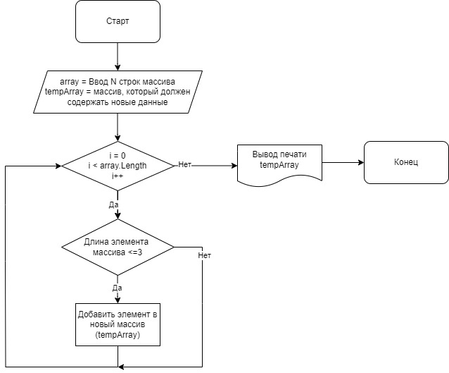

# Основной блок
## Контрольная работа

## Описание
Для полноценного выполнения проверочной работы необходимо:

1. Создать репозиторий на GitHub
2. Нарисовать блок-схему алгоритма (можно обойтись блок-схемой основной содержательной части, если вы выделяете её в отдельный метод)
3. Снабдить репозиторий оформленным текстовым описанием решения (файл README.md)
4. Написать программу, решающую поставленную задачу
5. Использовать контроль версий в работе над этим небольшим проектом (не должно быть так, что всё залито одним коммитом, как минимум этапы 2, 3, и 4 должны быть расположены в разных коммитах)

Задача: Написать программу, которая из имеющегося массива строк формирует новый массив из строк, длина которых меньше, либо равна 3 символам. Первоначальный массив можно ввести с клавиатуры, либо задать на старте выполнения алгоритма. При решении не рекомендуется пользоваться коллекциями, лучше обойтись исключительно массивами.

## Пример работы программы

`[“Hello”, “2”, “world”, “:-)”] → [“2”, “:-)”]`

`[“1234”, “1567”, “-2”, “computer science”] → [“-2”]`

`[“Russia”, “Denmark”, “Kazan”] → []`

## Как запустить

# Шаг 1: Создать репозиторий на GitHub

1. Перейдите на GitHub.
2. Войдите в свою учетную запись.
3. Нажмите на кнопку New repository.
4. Назовите репозиторий, например, MainBlock_ControlWork.
5. Добавьте описание: "Программа на C#, фильтрующая строки массива по длине". 
6. Убедитесь, что отмечена опция "Initialize this repository with a README".
7. Нажмите Create repository.

# Шаг 2: Нарисовать блок-схему алгоритма
Для решения задачи нам нужно пройти по массиву строк, проверяя длину каждой строки. Если строка содержит 3 символа или меньше, добавляем её в новый массив.

Блок-схема:

# Шаг 3: Оформить файл README.md
В файле README.md опиcываем задачу и алгоритм решения.

# Шаг 4: Пишем программу на C#

1. Открываем Visual Studio Code или другой редактор для C#.
2. Запускаем программу, создаем проект.
3. Пишем программу на C#.

# Шаг 5: Использование контроля версий

1. Коммитим все изменения.
2. Отправляем все изменения на GitHub.
